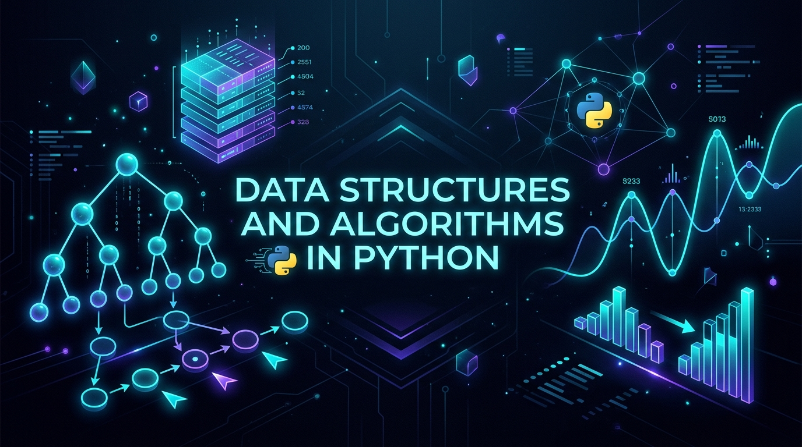

<p align="center">
  
</p>

<div align="center">

# 🚀 Complete Data Structures & Algorithms in Python

[](https://www.python.org/)
[](https://jupyter.org/)
[](LICENSE)
[](https://github.com/udityamerit/Complete-Data-Structure-Algorithms-In-Python)
[](http://makeapullrequest.com)
[](https://github.com/udityamerit/Complete-Data-Structure-Algorithms-In-Python/stargazers)

<p align="center">
  <b>A comprehensive, clean, and intuitive deep-dive into Data Structures, Core Algorithms, and Technical Interview Problem-Solving Patterns implemented in pure Python.</b>
</p>

[Explore Curriculum](#-curriculum--module-breakdown) •
[Complexity Cheat Sheet](#-big-o-complexity-cheat-sheet) •
[Code Highlights](#-code-highlights--patterns) •
[Quick Start](#-quick-start--setup) •
[Roadmap](#-future-roadmap)

</div>

---

## 📖 Overview

Mastering **Data Structures and Algorithms (DSA)** is the single most critical milestone for software engineers, technical interview candidates, and competitive programmers. 

This repository provides an organized, hands-on, and visual approach to learning DSA from first principles using **Python 3**. Each module combines theoretical intuition, line-by-line implementations, edge case handling, and asymptotic time/space complexity analysis across interactive **Jupyter Notebooks** and modular Python scripts.

### 🌟 Key Highlights

- 🧠 **Concept-First Pedagogy**: Starts with core language mechanics (`*args`, `**kwargs`, memory references) before diving into complex structures.
- ⚡ **Optimized Implementations**: Shows naive approaches first (e.g., $O(N^2)$ Linked List input), analyzes the bottlenecks, and refactors to optimal $O(N)$ algorithms.
- 📓 **Interactive Jupyter Notebooks**: Run, test, visualize, and modify algorithms cell-by-cell in your browser or IDE.
- 📊 **Detailed Big-O Analyses**: Every algorithm is accompanied by rigorous Best, Average, and Worst-case time and space complexity evaluations.

---

## 📑 Table of Contents

- [Overview](#-overview)
- [Repository Structure](#-repository-structure)
- [Curriculum & Module Breakdown](#-curriculum--module-breakdown)
  - [01. Dictionaries & Hashing](#01-dictionaries--hashing)
  - [02. Python Functions & Parameter Mastery](#02-python-functions--parameter-mastery)
  - [03. Searching & Sorting Algorithms](#03-searching--sorting-algorithms)
  - [04. Recursion & Mathematical Thinking](#04-recursion--mathematical-thinking)
  - [05. Linked Lists](#05-linked-lists)
  - [06. Stacks & LIFO Applications](#06-stacks--lifo-applications)
- [Big-O Complexity Cheat Sheet](#-big-o-complexity-cheat-sheet)
- [Code Highlights & Patterns](#-code-highlights--patterns)
- [Quick Start & Setup](#-quick-start--setup)
- [Future Roadmap](#-future-roadmap)
- [Contributing](#-contributing)
- [License & Author](#-license--author)

---

## 📚 Curriculum & Module Breakdown

| Module | Core Topic | Key Concepts Covered | Primary Files |
| :--- | :--- | :--- | :--- |
| **01** | **[Dictionaries](#01-dictionaries--hashing)** | Hash maps, key-value lookups, shallow copies, dictionary comprehensions, frequency maps, merging overlapping keys, subset matching | [`Dictionary.ipynb`](01%20Dictionaries/Dictionary.ipynb) |
| **02** | **[Functions](#02-python-functions--parameter-mastery)** | Variable positional `*args`, keyword `**kwargs`, function scopes, passing mutable collections, in-place reversals | [`functions.ipynb`](02%20Functions/functions.ipynb) |
| **03** | **[Searching & Sorting](#03-searching--sorting-algorithms)** | Array module vs lists, Binary Search ($O(\log N)$), Bubble Sort, Selection Sort, Insertion Sort | [`search sort.ipynb`](03%20Searching%20And%20Sorting/search%20sort.ipynb) |
| **04** | **[Recursion](#04-recursion--mathematical-thinking)** | Mathematical induction, base conditions, call stack lifecycle, computing $2^N$, cumulative sum of natural numbers | [`recursion.ipynb`](04%20Recursion/recursion.ipynb) |
| **05** | **[Linked Lists](#05-linked-lists)** | Singly Linked List, `Node` structure, $O(N)$ optimized input taking using tail pointer vs $O(N^2)$ naive input, insertion at head/position, length calculation | [`LinkedList.ipynb`](05%20Linkedlist/LinkedList.ipynb), [`common.py`](05%20Linkedlist/common.py) |
| **06** | **[Stacks](#06-stacks--lifo-applications)** | Last-In-First-Out (LIFO) design, push, pop, peek, overflow/underflow handling, stack applications | [`stack.ipynb`](06%20Stack/stack.ipynb) |

---

### 01. Dictionaries & Hashing
> *Fast $O(1)$ average-time lookups, key-value transformations, and frequency mapping.*

- **Foundations**: Dictionary instantiation (`{}`, `dict()`), safe lookups using `.get(key, default)`, key deletion (`del`), and dictionary iteration via `.items()`, `.keys()`, and `.values()`.
- **Memory References**: Differentiating between alias assignment (`dict1 = dict2`) and shallow copies (`dict.copy()`).
- **Comprehensions**: Fast mapping and filtering with dict comprehensions `{k: v for k, v in ...}`.
- **Problem Solving**:
  - Character and integer frequency counting in $O(N)$ time.
  - Finding elements with maximum frequency.
  - Merging multiple dictionaries with collision strategies (combining values of overlapping keys).
  - Subset validation algorithms.

---

### 02. Python Functions & Parameter Mastery
> *Writing clean, scalable, and idiomatic Python code for algorithm design.*

- **Dynamic Arguments**: Handling flexible parameter counts using `*args` (positional tuple unpacking) and `**kwargs` (keyword dictionary unpacking).
- **Mutations & In-place Logic**: Understanding how Python passes references to mutable objects (lists, dictionaries) and crafting memory-efficient in-place algorithms.

---

### 03. Searching & Sorting Algorithms
> *Fundamental algorithmic paradigms for organizing and locating data.*

- **Searching**:
  - **Binary Search**: Logarithmic $O(\log N)$ search over sorted arrays through continuous boundary halving (`mid = (start + end) // 2`).
- **Elementary Sorting**:
  - **Bubble Sort**: Neighbor element comparison and bubble-up bubbling passes with $O(N^2)$ worst-case.
  - **Selection Sort**: Iterative minimum-element selection and single swap per pass.
  - **Insertion Sort**: Online card-insertion paradigm with early termination for nearly-sorted inputs.

---

### 04. Recursion & Mathematical Thinking
> *Breaking down complex problems into self-similar subproblems.*

- **The Recursive Leap of Faith**:
  1. **Base Case**: The simplest terminating condition that prevents infinite call-stack recursion.
  2. **Inductive Step**: Assuming subproblems work (`f(n - 1)`) and combining results.
- **Implementations**:
  - Fast exponentiation calculation ($2^N$).
  - Sum of first $N$ natural numbers ($f(n) = n + f(n - 1)$).

---

### 05. Linked Lists
> *Dynamic memory allocation, pointer-based data chaining, and linear traversals.*

- **Singly Linked List**: Dynamic node creation with `Node(data, next)`.
- **Input Taking Optimization**:
  - *Naive Approach*: Appending each new element by traversing from head to end ($O(N^2)$ time).
  - *Optimized Approach*: Maintaining a `tail` pointer to append nodes in $O(1)$ per item ($O(N)$ total time).
- **Core Operations**:
  - Traversal and visual printing (`node.data -> node.next.data -> None`).
  - Iterative length calculation.
  - Node insertion at index `0` (head update) and arbitrary position `i`.
  - Modular utility integration via [`common.py`](05%20Linkedlist/common.py).

---

### 06. Stacks & LIFO Applications
> *LIFO (Last-In, First-Out) operations for function call tracking, reversal, and state parsing.*

- **Core Mechanics**: Push, Pop, Peek/Top, IsEmpty, and Size tracking.
- **Implementations**: Dynamic array-based stack implementation with runtime safety checks.

---

## ⚡ Big-O Complexity Cheat Sheet

### Data Structure Operations

| Data Structure | Access (Avg) | Search (Avg) | Insertion (Avg) | Deletion (Avg) | Space Complexity |
| :--- | :---: | :---: | :---: | :---: | :---: |
| **Python List (Dynamic Array)** | $O(1)$ | $O(N)$ | $O(1)$ (amortized) | $O(N)$ | $O(N)$ |
| **Singly Linked List** | $O(N)$ | $O(N)$ | $O(1)$ (at head) | $O(1)$ (at head) | $O(N)$ |
| **Stack (Array/List-based)** | $O(N)$ | $O(N)$ | $O(1)$ (push) | $O(1)$ (pop) | $O(N)$ |
| **Hash Map (Python Dict)** | $O(1)$ | $O(1)$ | $O(1)$ | $O(1)$ | $O(N)$ |

### Sorting Algorithms

| Algorithm | Best Time | Average Time | Worst Time | Space | Stable? |
| :--- | :---: | :---: | :---: | :---: | :---: |
| **Bubble Sort** | $O(N)$ | $O(N^2)$ | $O(N^2)$ | $O(1)$ | Yes |
| **Selection Sort** | $O(N^2)$ | $O(N^2)$ | $O(N^2)$ | $O(1)$ | No |
| **Insertion Sort** | $O(N)$ | $O(N^2)$ | $O(N^2)$ | $O(1)$ | Yes |
| **Binary Search** | $O(1)$ | $O(\log N)$ | $O(\log N)$ | $O(1)$ | N/A |

---

## 💡 Code Highlights & Patterns

### 1. Optimized Linked List Input ($O(N)$ with Tail Pointer)
```python
class Node:
    def __init__(self, value):
        self.data = value
        self.next = None

def linked_input_optimized():
    """
    Takes user input until -1 is entered.
    Uses a tail pointer to achieve O(N) overall time complexity.
    """
    value = int(input("Enter node value (-1 to stop): "))
    head = None
    tail = None

    while value != -1:
        new_node = Node(value)
        if head is None:
            head = new_node
            tail = new_node
        else:
            tail.next = new_node
            tail = new_node
        value = int(input("Enter node value (-1 to stop): "))

    return head
```

### 2. Binary Search ($O(\log N)$ Time, $O(1)$ Space)
```python
def binary_search(arr, target):
    """
    Searches for target in sorted array 'arr'.
    Returns index if found, else -1.
    """
    start, end = 0, len(arr) - 1

    while start <= end:
        mid = (start + end) // 2

        if arr[mid] == target:
            return mid
        elif arr[mid] > target:
            end = mid - 1
        else:
            start = mid + 1

    return -1
```

### 3. Merging Dictionaries with Overlapping Keys
```python
def merge_dicts_with_overlapping_keys(dicts):
    """
    Combines a list of dictionaries, summing values for duplicate keys.
    """
    merged = {}
    for d in dicts:
        for key, val in d.items():
            merged[key] = merged.get(key, 0) + val
    return merged
```

---

## 🚀 Quick Start & Setup

### Prerequisites
Make sure you have **Python 3.8 or higher** installed on your system.
```bash
python --version
```

### 1. Clone the Repository
```bash
git clone https://github.com/udityamerit/Complete-Data-Structure-Algorithms-In-Python.git
cd Complete-Data-Structure-Algorithms-In-Python
```

### 2. Set Up a Virtual Environment (Recommended)

**On Windows (PowerShell):**
```powershell
python -m venv venv
.\venv\Scripts\Activate.ps1
```

**On macOS / Linux:**
```bash
python3 -m venv venv
source venv/bin/activate
```

### 3. Install Jupyter Notebook / Lab
```bash
pip install --upgrade pip
pip install jupyter notebook ipykernel
```

### 4. Launch Jupyter Notebook
```bash
jupyter notebook
```
Navigate to any directory (`01 Dictionaries`, `03 Searching And Sorting`, etc.) and open `.ipynb` files to experiment interactively!

> **Tip for VS Code users**: You can also open the folder directly in [Visual Studio Code](https://code.visualstudio.com/) with the **Python** and **Jupyter** extensions installed to run cells natively with interactive debugging!

---

## 🗺️ Future Roadmap

- [x] **Module 01**: Dictionaries & Hash Maps
- [x] **Module 02**: Function Parameter Dynamics & Scoping
- [x] **Module 03**: Searching & Elementary Sorting Algorithms
- [x] **Module 04**: Recursion & Divide-and-Conquer Foundations
- [x] **Module 05**: Singly Linked Lists (Operations & Optimizations)
- [x] **Module 06**: Stacks & LIFO Principles
- [ ] **Module 07**: Queues, Double-Ended Queues (Deques), and Circular Queues
- [ ] **Module 08**: Binary Trees, Binary Search Trees (BST), and Traversals (Inorder, Preorder, Postorder, Level-Order)
- [ ] **Module 09**: Priority Queues & Heaps (Min-Heap, Max-Heap, HeapSort)
- [ ] **Module 10**: Graph Algorithms (BFS, DFS, Dijkstra, Cycle Detection, Topological Sort)
- [ ] **Module 11**: Dynamic Programming (Memoization vs Tabulation, Knapsack, LCS, LIS)
- [ ] **Module 12**: Backtracking, Greedy Algorithms, and Bit Manipulation

---

## 🤝 Contributing

Contributions are warmly welcomed! Whether it's adding new problems, optimizing existing solutions, fixing typos, or adding detailed markdown explanations:

1. **Fork** the repository.
2. **Create a Feature Branch**:
   ```bash
   git checkout -b feature/NewAlgorithmOrTopic
   ```
3. **Commit your changes**:
   ```bash
   git commit -m "feat: add implementation and notes for Queue data structure"
   ```
4. **Push to the branch**:
   ```bash
   git push origin feature/NewAlgorithmOrTopic
   ```
5. **Open a Pull Request** with a detailed description of your changes.

---

## 📄 License

This project is licensed under the **MIT License** - see the [LICENSE](LICENSE) file for details.

---

## 👨‍💻 Author & Connect

**Uditya**  
GitHub: [@udityamerit](https://github.com/udityamerit)  

<p align="center">
  <b>⭐ If you found this repository helpful, please consider giving it a star on GitHub! ⭐</b>
</p>
